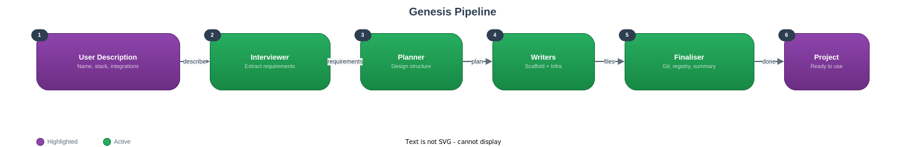

# Architecture

**Navigation:** [Home](.) | [Getting Started](getting-started) | [How It Works](how-it-works) | [Generated Projects](generated-project) | [Customisation](customisation) | [Updating](updating) | [FAQ](faq)

---

This document describes the internal architecture of Genesis itself, not the projects it generates. For the anatomy of a generated project, see [generated project](generated-project).

## Overview

## Agents

Genesis uses five specialised agents, each responsible for a distinct phase or concern of the bootstrap workflow.

### interviewer.md

Handles Phase 1. Reads the user's opening message, extracts project details, and asks only the minimum necessary follow-up questions. Reads `personalisation.md` and `environment.md` to avoid re-asking known information.

### planner.md

Handles Phase 2. Consults the agent catalogue and stack profiles to assemble a generation plan. Selects domain agents, dynamic skills, MCP servers, and folder structure. Presents the plan for user approval.

### scaffold-writer.md

Handles the application boilerplate portion of Phase 3. Writes entry points, package configuration, test setup, documentation stubs, and `.gitignore`. Consults stack profiles for idiomatic structures.

### claude-infra-writer.md

Handles the Claude infrastructure portion of Phase 3. Writes `CLAUDE.md`, `.claude/settings.json`, agent files, skill files, `.mcp.json`, and memory files. Uses templates as starting points and fills them with project-specific content.

### finaliser.md

Handles Phase 4. Initialises git, creates the initial commit, updates the project registry, and prints the summary with next steps.

## Skills

### /genesis

The main entry point. Orchestrates the full four-phase workflow. This is the skill invoked when a user describes a new project. It coordinates the agents and ensures each phase completes before the next begins.

**Location:** `.claude/skills/genesis/SKILL.md`

### /registry

Views all projects previously created by Genesis. Reads the project registry from memory and displays it in a formatted table.

**Location:** `.claude/skills/registry/SKILL.md`

### /validate

Checks that a generated project's Claude infrastructure is complete and well-formed. Verifies the presence and validity of CLAUDE.md, settings.json, agents, skills, memory files, and MCP configuration.

**Location:** `.claude/skills/validate/SKILL.md`

### /update

Pulls the latest Genesis updates from the remote repository. Checks for incoming changes, shows a summary, asks for confirmation, and applies the update. Preserves user configuration files.

**Location:** `.claude/skills/update/SKILL.md`

## Templates

Templates live in `.claude/skills/genesis/templates/` and use `{{PLACEHOLDER}}` syntax. The `claude-infra-writer` agent fills these during generation.

| Template | Purpose |
|----------|---------|
| `CLAUDE.md.tmpl` | Skeleton for the generated project's CLAUDE.md, including all global rules |
| `settings.json.tmpl` | Skeleton for permissions, hooks, and stop hooks |
| `agent.md.tmpl` | Skeleton for agent files with role, model, tools, and instructions |
| `skill.md.tmpl` | Skeleton for skill files with YAML frontmatter and workflow |
| `mcp.json.tmpl` | Skeleton for MCP server configuration |
| `memory-user.md.tmpl` | User profile memory, seeded from personalisation.md |
| `memory-project.md.tmpl` | Project context memory with placeholder fields |

## References

Reference documents provide the knowledge base that agents consult during planning and generation.

### agent-catalogue.md

Contains definitions for all available agents: 3 workflow agents (always included) and 14 domain agents (selected based on project type). Each entry specifies the agent's purpose, model tier, tools, and selection criteria.

**Location:** `.claude/skills/genesis/references/agent-catalogue.md`

### stack-profiles.md

Contains conventions for 6 supported stacks: Node.js/TypeScript, Python, Go, Rust, Ruby, and Java/Kotlin. Each profile covers project config, linting/formatting, testing, permissions, commit style, folder structure, and error patterns. Also includes cross-stack patterns for Docker, CI/CD, databases, APIs, CLIs, and libraries.

**Location:** `.claude/skills/genesis/references/stack-profiles.md`

## Memory System

Genesis uses Claude Code's memory system to persist information across sessions. Memory files live at `~/.claude/projects/-home-xeeva-claude-genesis/memory/`.

### MEMORY.md

The index file that points to other memory files. Claude reads this automatically at the start of each session.

### user-profile.md

Stores the user's role, experience, preferences, and interaction style. Seeded during first-time setup from answers and defaults.

### project-registry.md

Maintains a registry of all projects generated by Genesis, including name, path, stack, creation date, and status.

## Configuration Separation

Genesis separates three concerns into distinct files to enable clean updates:

### CLAUDE.md (version-controlled)

The master instruction file. Contains the complete workflow, global rules, agent selection guidelines, skill selection guidelines, and MCP server selection logic. Updated with Genesis.

### personalisation.md (gitignored)

User-specific preferences: locale, em dash rules, output verbosity, interaction style, role, experience level, and generated project defaults. Created during first-time setup. Never overwritten by updates.

### environment.md (gitignored)

Platform-specific configuration: operating system, shell, package manager, paths. Created during first-time setup. Never overwritten by updates.

### .example Files (version-controlled)

`personalisation.md.example` and `environment.md.example` are templates that ship with Genesis. They document all available configuration options and serve as the basis for first-time setup. These are updated with Genesis, so after an update you can check whether new options have been added.

## How Updates Work

When you run `/update` or `git pull`:

1. All version-controlled files are updated: CLAUDE.md, agents, skills, templates, references, `.example` files
2. Gitignored files are untouched: `personalisation.md`, `environment.md`, `.claude/settings.local.json`
3. Previously generated projects are completely independent and unaffected

This separation ensures that Genesis improvements (new stack profiles, better templates, additional agents) reach you without losing your personal configuration.
