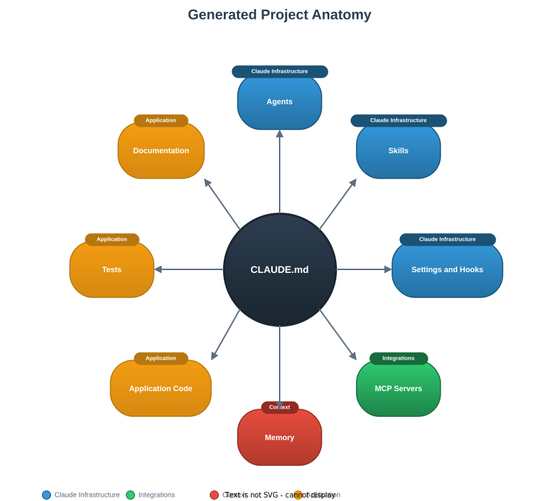

# Generated Project Anatomy

This document describes every file and directory that Genesis creates when it scaffolds a new project.



## Directory Structure

A typical generated project looks like this (using a Python FastAPI example):

```
widget-api/
├── CLAUDE.md
├── .claude/
│   ├── settings.json
│   ├── agents/
│   │   ├── test-runner.md
│   │   ├── code-reviewer.md
│   │   ├── doc-writer.md
│   │   ├── api-designer.md
│   │   ├── data-modeller.md
│   │   └── auth-specialist.md
│   └── skills/
│       ├── test/
│       │   └── SKILL.md
│       ├── lint/
│       │   └── SKILL.md
│       ├── review/
│       │   └── SKILL.md
│       ├── commit/
│       │   └── SKILL.md
│       ├── endpoint/
│       │   └── SKILL.md
│       └── migrate/
│           └── SKILL.md
├── .mcp.json
├── .gitignore
├── pyproject.toml
├── src/
│   └── widget_api/
│       ├── __init__.py
│       ├── main.py
│       ├── routes/
│       ├── services/
│       └── models/
├── tests/
│   ├── conftest.py
│   └── test_health.py
├── migrations/
└── docs/
    ├── README.md
    └── architecture.md
```

The exact structure varies by stack. A Go project uses `cmd/` and `internal/`, a Node.js project uses `src/` with `package.json`, and so on.

## CLAUDE.md

The most important file in any generated project. It serves as the project's brain, providing Claude with everything it needs to work effectively.

**Contains:**

- **Project identity**: name, purpose, stack, key integrations
- **Language and locale rules**: sourced from your personalisation.md (e.g. Australian English, no em dashes)
- **Error handling rules**: fail fast, explicit error handling, no silent swallowing
- **Code standards**: OWASP awareness, clean code rules, DRY/SOLID principles
- **Testing mandates**: tests are mandatory, test names describe behaviour
- **Documentation rules**: docs/ directory, inline comments only where logic is not self-evident
- **Commit style**: Conventional Commits for services/libraries, plain imperative for scripts/tools
- **Stack-specific conventions**: the idiomatic patterns for the chosen language and framework

This file is consulted by Claude at the start of every session and governs all code generation, reviews, and suggestions.

The size and structure of CLAUDE.md varies by scaffold profile:

- **Lean (Pro plan):** Uses a condensed template that merges language, error handling, code standards, and testing into a single "Standards" section. Omits the project structure tree and key commands sections. Combines agents and skills into a compact table. Includes a context management note. Approximately 50% smaller than the standard template.
- **Standard (Max plan):** The full template with all sections clearly separated.
- **Full (ProMax plan):** The full template with additional context sections and extended project-specific rules.

## .claude/settings.json

Configures Claude Code's permissions and automated hooks for the project.

**Permissions** grant Claude the ability to run specific Bash commands without asking. For example, a Python project might include:

```json
{
  "permissions": {
    "allow": [
      "Bash(python:*)",
      "Bash(pip:*)",
      "Bash(pytest:*)",
      "Bash(ruff:*)",
      "Bash(uv:*)"
    ]
  }
}
```

**Hooks** automate formatting and linting. A typical Python project includes:

- **PostToolUse hook**: runs `ruff check --fix` and `ruff format` automatically after Claude edits `.py` files
- **Stop hook**: reminds Claude to run tests and commit before ending a session

Every generated project includes a **statusline configuration** that displays the current model and context usage percentage at the bottom of the Claude Code interface. This is particularly valuable for Pro and Max users who need to monitor their context budget, but useful for all plans. The statusline updates in real time as you work, showing something like:

```
[Claude Sonnet 4.6] ctx: 34%
```

This gives you immediate visibility into when you might want to run `/compact` to free up context space.

When the risk-evaluator agent is included, a **PreToolUse hook** on Bash commands is also configured. This injects a risk evaluation prompt before every shell command, automatically screening for dangerous operations.

Permissions and hooks are tailored to the stack using the stack profiles reference.

## .claude/agents/

Contains one Markdown file per agent. Every project includes three workflow agents:

### test-runner.md

Runs the project's test suite, analyses failures, and provides context about what broke and why. Uses Bash, Read, Grep, and Glob tools. Invoked after code changes, before commits, and when debugging test failures.

### code-reviewer.md

Reviews code for quality, style, correctness, security, and adherence to the project's CLAUDE.md standards. Uses Read, Grep, and Glob tools. Invoked before merging, after completing a feature, and on request.

### doc-writer.md

Generates and updates documentation, including README files, architecture docs, and inline comments. Uses Read, Write, Edit, Grep, and Glob tools. Invoked after adding features, when architecture changes, and on request.

### risk-evaluator.md (when external integrations are present)

Evaluates the risk of potentially dangerous operations using a 1-5 severity rubric. Screens destructive commands (DROP TABLE, rm -rf), state mutations (migrations, config changes), external writes (API calls, deployments), and permission escalation. Severity 1-2 proceeds silently, severity 3 warns, severity 4-5 halts and requires explicit confirmation. The rubric is context-sensitive: the same operation scores differently based on the project's specific integrations.

### Domain agents (2-4 additional)

Selected based on the project type. Examples:

- **api-designer**: designs REST/GraphQL endpoints and schemas (API projects)
- **data-modeller**: designs database schemas and relationships (database projects)
- **auth-specialist**: implements authentication and authorisation (projects with auth)
- **component-architect**: designs component hierarchy and state management (frontend projects)
- **cli-designer**: designs command structure and output formatting (CLI projects)
- **pipeline-architect**: designs data pipelines and ETL workflows (data projects)
- **security-reviewer**: audits for security vulnerabilities (security-sensitive projects)

See the [agent catalogue](https://github.com/xeeva/Genesis/blob/main/.claude/skills/genesis/references/agent-catalogue.md) for the full list.

## .claude/skills/

Contains one directory per skill, each with a `SKILL.md` file that defines when and how the skill is invoked.

### Base skills (always included)

| Skill | Purpose |
|-------|---------|
| `/test` | Run the project's test suite using the stack's test framework |
| `/lint` | Run linters and formatters using the stack's toolchain |
| `/review` | Trigger a code review using the code-reviewer agent |
| `/commit` | Stage changes and create a well-formed commit message |

### Dynamic skills (selected by project type)

| Skill | Purpose | Project types |
|-------|---------|---------------|
| `/endpoint` | Scaffold a new API endpoint | API, web service |
| `/migrate` | Create a database migration | Projects with databases |
| `/component` | Scaffold a new UI component | Frontend |
| `/storybook` | Generate Storybook stories | Frontend with Storybook |
| `/run` | Build and run the project | CLI tools |
| `/build` | Compile/build the project | CLI tools, compiled languages |
| `/pipeline` | Scaffold a data pipeline stage | Data projects |
| `/query` | Write and test database queries | Data projects |

## .mcp.json

Configures MCP (Model Context Protocol) servers for external integrations. Only present if the project has integrations that benefit from MCP.

**Example for a PostgreSQL project:**

```json
{
  "mcpServers": {
    "postgres": {
      "command": "npx",
      "args": ["-y", "@modelcontextprotocol/server-postgres", "postgresql://localhost:5432/widget_api"]
    }
  }
}
```

**Available MCP servers:**

| Server | Integration |
|--------|-------------|
| postgres | PostgreSQL databases |
| mysql | MySQL databases |
| sqlite | SQLite databases |
| github | GitHub API (issues, PRs, repos) |
| playwright | Browser testing and automation |
| aws | AWS services |

Genesis only configures MCP servers that the project actually needs. No speculative integrations.

## Memory Files

Written to `~/.claude/projects/-home-xeeva-claude-<name>/memory/`, outside the project directory. Claude reads these automatically at the start of each session.

### MEMORY.md

An index file that points to the other memory files:

```markdown
- [User Profile](user-profile.md)
- [Project Context](project-context.md)
```

### user-profile.md

Contains your role, experience level, interaction preferences, and working style. Seeded from your Genesis personalisation.md so that every generated project inherits your preferences.

### project-context.md

Contains project-specific context: name, purpose, stack, key integrations, creation date, and any architectural decisions made during planning.

## Application Boilerplate

Genesis generates a minimal but functional starting point for the chosen stack.

### Entry points

The main application file. Examples: `src/main.py` (Python), `cmd/<name>/main.go` (Go), `src/index.ts` (Node.js), `src/main.rs` (Rust).

### Package configuration

The package or project manifest. Examples: `pyproject.toml` (Python), `go.mod` (Go), `package.json` (Node.js), `Cargo.toml` (Rust), `Gemfile` (Ruby), `build.gradle.kts` (Java/Kotlin).

### Test setup

Test framework configuration and a sample test that verifies the project runs. The sample test is intentionally simple; it exists to confirm the test infrastructure works.

### Stack-specific configuration

Files like `tsconfig.json` (TypeScript), `.golangci.yml` (Go), `ruff.toml` (Python), or `rustfmt.toml` (Rust) that configure the stack's tools with sensible defaults.

## Documentation

### docs/README.md

Project documentation with the project name, purpose, setup instructions, and usage guide.

### docs/architecture.md

A high-level architecture document describing the project's structure, key components, data flow, and design decisions.

## .gitignore

A stack-appropriate gitignore file. Covers:

- Language-specific build artifacts and caches
- IDE and editor files
- Environment files (`.env`, `.env.*`)
- OS files (`.DS_Store`, `Thumbs.db`)
- Dependency directories (`node_modules/`, `__pycache__/`, `target/`)
- Log files
