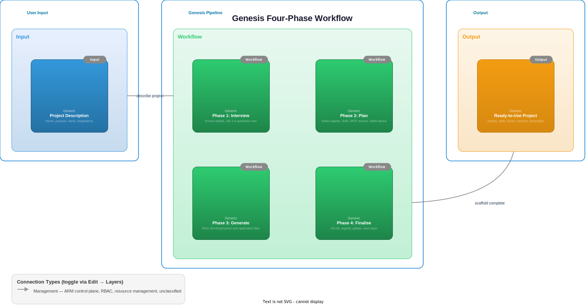

# How It Works

Genesis follows a strict four-phase workflow. Each phase completes before the next begins, and you have the opportunity to review and adjust at key decision points.



## Phase 1: Interview

Genesis reads your opening message and extracts as much information as it can. It gathers four things:

1. **Project name**: a kebab-case identifier (e.g. `widget-api`, `data-pipeline`, `cli-tool`)
2. **Purpose**: a one-sentence description of what the project does
3. **Tech stack**: language, framework, and runtime
4. **Key integrations**: databases, APIs, auth providers, message queues, external services

The goal is to minimise questions. If your opening message covers three or four of these, Genesis asks only what remains (1-2 questions). If your message is vague, it asks up to 4 targeted questions.

### Example: Detailed Opening

**You:** "Create a Go REST API called inventory-service with PostgreSQL and JWT auth"

Genesis extracts: name (`inventory-service`), stack (Go), integrations (PostgreSQL, JWT). It might ask:

> What is the primary purpose of inventory-service? (e.g. "manage warehouse stock levels for an e-commerce platform")

### Example: Vague Opening

**You:** "I need a new backend service"

Genesis asks:

> 1. What should the project be called?
> 2. What will it do? (one sentence)
> 3. What tech stack? (language and framework)
> 4. Any integrations? (databases, APIs, auth, etc.)

### What Genesis Already Knows

Genesis reads your `environment.md` (platform, shell, package manager) and `personalisation.md` (locale, output style, role) before the interview. It never re-asks information captured during first-time setup.

The project path is derived from the project base directory in `environment.md` combined with the project name. If you specify a custom path in your opening message, Genesis uses that instead.

## Context-Aware Scaffolding

Genesis adjusts the size and complexity of the generated scaffold based on your Claude plan tier. This is critical because every file Genesis creates (CLAUDE.md, agents, skills, memory, settings) consumes context tokens that are loaded into every conversation. A scaffold that is too large for the plan can leave insufficient room for actual work.

### Why This Matters

Claude Code loads your project's CLAUDE.md, settings, and memory files at the start of every session. When you invoke an agent, its definition is loaded too. Skills are loaded when invoked. All of this draws from your context window, which varies significantly by plan:

| Plan | Context | Impact |
|:--|:--|:--|
| **Pro** | 200k | Infrastructure needs to be lean to leave room for complex tasks and multi-step workflows. |
| **Max** | 200k | Same context as Pro, but higher rate limits. A moderate scaffold works well. |
| **ProMax** | 1M | Five times Pro/Max. Room for comprehensive infrastructure and extended sessions. |
| **API** | Varies | Depends on model and configuration. Genesis asks during setup. |

A full scaffold (7 agents, 7 skills, detailed CLAUDE.md, 3 memory files, MCP configs) can consume 15-25k tokens. On a Pro plan, that is 7-12% of the entire context window gone before you type your first message. On ProMax, it is 1.5-2.5%, leaving plenty of room.

### Scaffold Profiles

Genesis maps each plan tier to a scaffold profile that balances infrastructure richness against context budget:

| Profile | Plan | Context | Agents | Skills | CLAUDE.md | Cost |
|:--|:--|:--|:--|:--|:--|:--|
| **lean** | Pro | 200k | 1-2 | 1-2 | Condensed | ~5-8k (2.5-4%) |
| **standard** | Max | 200k | 2-3 | 2-3 | Standard | ~10-15k (5-7.5%) |
| **full** | ProMax/API | 1M | 3-4 | 3-4 | Detailed | ~15-25k (1.5-2.5%) |

The estimated cost is shown in the plan output (Phase 2) so you can see exactly how much of your context window the scaffold will use.

The scaffold profile is set during first-time setup and stored in `environment.md`. It can be overridden at any time by editing the file or by requesting a different profile during the plan phase.

### What Changes by Profile

**Lean (Pro)**
- Condensed CLAUDE.md template: language, error handling, code standards, and testing rules merged into a single "Standards" section. No project structure tree (the filesystem is self-documenting). Agents and skills listed in a compact table rather than separate sections.
- Consolidated memory: user profile and project context written inline in a single MEMORY.md rather than three separate files.
- Minimal agents: only the single most critical domain agent for the project type (e.g. api-designer for an API project, data-modeller for a database project) plus the three mandatory workflow agents.
- Context management section: the generated CLAUDE.md includes guidance on using `/compact` when context exceeds 60%.

**Standard (Max)**
- Full CLAUDE.md template with all sections.
- Full memory files (MEMORY.md index, user-profile.md, project-context.md).
- Moderate agent selection: 2-3 domain agents covering the primary concerns of the project.
- 2-3 dynamic skills tailored to the domain.

**Full (ProMax / API with large context)**
- Detailed CLAUDE.md with extended context sections and additional project-specific rules.
- Full memory files.
- Comprehensive agent selection: 3-4 domain agents covering primary and secondary concerns.
- 3-4 dynamic skills.
- The generated project has room for long, complex sessions without worrying about context limits.

### Context Monitoring

Every generated project, regardless of profile, includes a statusline that displays the current model and context usage percentage at the bottom of the Claude Code interface. This gives you real-time visibility into how much of your context window is in use, so you can run `/compact` before things get tight.

### Upgrading Your Experience

If you start on a Pro plan and later upgrade to Max or ProMax, you can update your scaffold profile to take advantage of the additional context:

1. Edit `environment.md` in the Genesis root directory
2. Change the **Tier** and **Context window** values
3. Change the **Scaffold profile** to match (e.g. `standard` for Max, `full` for ProMax)
4. New projects will use the updated profile. Existing projects are unaffected.

Higher-tier plans unlock progressively richer scaffolds: more specialised agents, more domain-specific skills, and more detailed project instructions. The ProMax plan with its 1M context window provides the best Genesis experience, with room for comprehensive infrastructure and extended working sessions.

## Phase 2: Plan

Once Genesis has all four pieces of information, it consults the stack profiles and agent catalogue, then presents a structured plan:

```
Project: inventory-service
Path: ~/claude/inventory-service/
Stack: Go, net/http (stdlib), PostgreSQL, JWT

Agents (domain):
- api-designer -- design REST endpoints and request/response schemas
- data-modeller -- design database schemas and relationships
- auth-specialist -- implement JWT authentication flows
- security-reviewer -- audit code for security vulnerabilities

Agents (workflow):
- test-runner -- run and analyse test results
- code-reviewer -- review code quality and correctness
- doc-writer -- generate and update documentation

Skills (base):
- /test -- run go test ./...
- /lint -- run golangci-lint
- /review -- trigger code review
- /commit -- stage and commit changes

Skills (dynamic):
- /endpoint -- scaffold a new API endpoint
- /migrate -- create a database migration

MCP Servers:
- postgres (PostgreSQL connection)

Folder Structure:
cmd/inventory-service/
internal/handlers/
internal/models/
internal/services/
internal/db/
migrations/
docs/
```

The base path (`~/claude/` in the example above) comes from the project base directory configured in `environment.md`. If you specified a different base path during setup or in your opening message, the plan reflects that instead.

### Adjustments

You can request changes before confirming:

- "Add a Redis integration"
- "Remove the security-reviewer agent"
- "Change the folder structure to use pkg/ instead of internal/"

Genesis adjusts the plan and re-presents it. Only after you confirm does it proceed to generation.

## Phase 3: Generate

Generation creates the entire project in a single pass. Genesis reads its templates and reference files, then writes every file.

### What Gets Created

**Infrastructure files:**

| File | Purpose |
|------|---------|
| `CLAUDE.md` | The project brain: rules, standards, stack-specific conventions, testing mandates |
| `.claude/settings.json` | Permissions (which Bash commands Claude can run), formatter hooks, stop hooks |
| `.claude/agents/*.md` | One file per agent with role-specific instructions |
| `.claude/skills/*/SKILL.md` | One directory per skill with invocation instructions |
| `.mcp.json` | MCP server configurations for external integrations |

**Memory files** (written to `~/.claude/projects/-home-xeeva-claude-<name>/memory/`):

| File | Purpose |
|------|---------|
| `MEMORY.md` | Index pointing to other memory files |
| `user-profile.md` | User role, preferences, and interaction style |
| `project-context.md` | Project name, purpose, stack, and key decisions |

**Application boilerplate:**

| File | Purpose |
|------|---------|
| Entry point(s) | `main.go`, `src/main.py`, `src/index.ts`, etc. |
| Package config | `go.mod`, `pyproject.toml`, `package.json`, `Cargo.toml`, etc. |
| Test setup | Test framework config and a sample test |
| `docs/README.md` | Project documentation |
| `docs/architecture.md` | High-level architecture description |
| `.gitignore` | Stack-appropriate ignores |
| Stack-specific config | `tsconfig.json`, `.golangci.yml`, `ruff.toml`, etc. |

### Template System

Genesis uses templates from `.claude/skills/genesis/templates/` as starting points. Each template contains placeholders (e.g. `{{PROJECT_NAME}}`, `{{STACK}}`) that are filled with project-specific values. The templates are:

- `CLAUDE.md.tmpl`: the project's CLAUDE.md skeleton
- `settings.json.tmpl`: permissions and hooks skeleton
- `agent.md.tmpl`: agent file skeleton
- `skill.md.tmpl`: skill file skeleton
- `mcp.json.tmpl`: MCP configuration skeleton
- `memory-user.md.tmpl`: user profile memory
- `memory-project.md.tmpl`: project context memory

### Stack Profiles

Genesis consults `.claude/skills/genesis/references/stack-profiles.md` for stack-specific conventions: folder structures, linter commands, test frameworks, permission entries, error handling patterns, and more.

### Agent Selection

Genesis consults `.claude/skills/genesis/references/agent-catalogue.md` to select domain agents. The three workflow agents (test-runner, code-reviewer, doc-writer) are always included. Domain agents are selected based on project type, capped at 3-4 to avoid overwhelming the workspace.

For projects with external integrations (databases, APIs, cloud services, message queues), Genesis includes a **risk-evaluator** agent that screens potentially dangerous operations before execution. It uses a severity rubric (1-5) to assess destructive operations, state mutations, external writes, and permission escalation. A PreToolUse hook on Bash commands provides automatic screening, and a `/risk` skill allows manual evaluation.

## Phase 4: Finalise

After all files are written, Genesis completes the setup:

### 4.1 Git Initialisation

```bash
cd ~/claude/<name> && git init && git add -A && git commit -m "Initial scaffold from Genesis"
```

The project starts with a clean git history and a single commit containing the full scaffold.

### 4.2 Registry Update

Genesis maintains a project registry in its own memory files. Each generated project is logged with its name, path, stack, date, and status.

### 4.3 Summary

Genesis prints a summary of everything it created:

```
Project created: ~/claude/inventory-service/
Stack: Go, net/http, PostgreSQL, JWT
Agents: 7 (api-designer, data-modeller, auth-specialist, security-reviewer, test-runner, code-reviewer, doc-writer)
Skills: 6 (/test, /lint, /review, /commit, /endpoint, /migrate)
MCP: postgres

Next steps:
  cd ~/claude/inventory-service/
  claude
```

## Complete Example: Python FastAPI Project

Here is a complete session from start to finish.

### Opening Message

> Create a Python FastAPI service called user-service for managing user accounts. It needs PostgreSQL for storage and JWT for authentication.

### Interview (Phase 1)

Genesis has all four pieces of information: name (`user-service`), purpose (managing user accounts), stack (Python/FastAPI), and integrations (PostgreSQL, JWT). No follow-up questions needed.

### Plan (Phase 2)

```
Project: user-service
Path: ~/claude/user-service/
Stack: Python, FastAPI, PostgreSQL, JWT

Agents (domain):
- api-designer -- design REST endpoints and request/response schemas
- data-modeller -- design database schemas and relationships
- auth-specialist -- implement JWT authentication flows
- security-reviewer -- audit code for security vulnerabilities

Agents (workflow):
- test-runner -- run and analyse test results
- code-reviewer -- review code quality and correctness
- doc-writer -- generate and update documentation

Skills (base):
- /test -- run pytest
- /lint -- run ruff check and format
- /review -- trigger code review
- /commit -- stage and commit changes

Skills (dynamic):
- /endpoint -- scaffold a new API endpoint
- /migrate -- create an Alembic migration

MCP Servers:
- postgres (PostgreSQL connection)

Folder Structure:
src/user_service/
  __init__.py
  main.py
  routes/
  services/
  models/
tests/
  conftest.py
migrations/
docs/
```

### Generation (Phase 3)

Genesis creates all files at `~/claude/user-service/`:

- `CLAUDE.md` with Python/FastAPI-specific rules, ruff configuration, pytest mandates
- `.claude/settings.json` with Python permissions (`python`, `pip`, `pytest`, `ruff`, `uv`)
- `.claude/agents/` with 7 agent files
- `.claude/skills/` with 6 skill directories
- `.mcp.json` with PostgreSQL MCP server config
- Memory files at `~/.claude/projects/-home-xeeva-claude-user-service/memory/`
- `pyproject.toml`, `src/user_service/main.py`, `tests/conftest.py`, sample test
- `docs/README.md`, `docs/architecture.md`
- `.gitignore` with Python-specific ignores

### Finalisation (Phase 4)

```
Project created: ~/claude/user-service/
Stack: Python, FastAPI, PostgreSQL, JWT
Agents: 7 (api-designer, data-modeller, auth-specialist, security-reviewer, test-runner, code-reviewer, doc-writer)
Skills: 6 (/test, /lint, /review, /commit, /endpoint, /migrate)
MCP: postgres

Next steps:
  cd ~/claude/user-service/
  claude
```

You are now ready to start building.
